```{r setup, include=FALSE}
knitr::opts_chunk$set(echo = FALSE)
library(DiagrammeR)
```


# Videos{.unlisted .unnumbered}

* 5 min 05 [Youtube Lange Video https://www.youtube.com/watch?v=ir9XWVHvrGA](https://www.youtube.com/watch?v=ir9XWVHvrGA)
* 60 sec [Youtube Korte Video https://youtube.com/shorts/G_LV0VVTu9M](https://youtube.com/shorts/G_LV0VVTu9M)


\newpage

# Hardware

## Fritzing Hardware Diagram

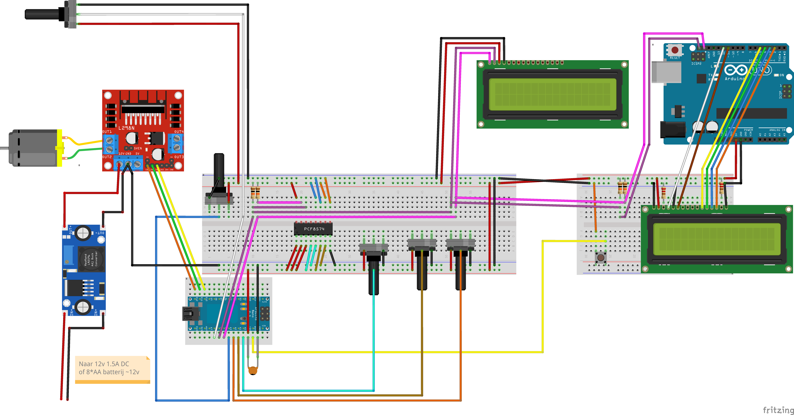

Kleur en positie van jumperwires op het breadboard zijn aangepast om de leesbaarheid en begrijpelijkheid te verbeteren.
De afbeelding is ook vergroot te zien in de appendix en op GitHub (samen met het Fritzing.fzz-bestand).

## Gebruikte Componenten

### Gemodelleerd in Fritzing:
* DC-DC Adjustable Step-down Buck Converter XL4015 4A - with voltage meter
* L298N DC-Motor Controller (HW-095)
* NXP PCF8574 IC
* 1602 LCD scherm (HD44780U) x2
  1602 I2C backpack (PCF8574T based)
* DC Motor
* Arduino Nano *ik gebruik een Nano-clone met Atmega168 in plaats van 328; het verschil is minder ROM (16k vs 32k)*
* Arduino Uno
* 10kΩ Weerstand x4
* 220Ω Weerstand x2
* 10kΩ Potentiometer B10k x5
* Condensator 22nF x3
* Drukknop
* Jumperwires x Veel

\pagebreak

### Extra Benodigde Hardware

* Aluminium Hoek-profiel L-vorm, dikte 2 mm (intern 10x10 mm, extern 12x12 mm) van 100 cm
* Aluminium L-vormige plankdrager 10cm x 10cm (gat uitboren zodat de potentiometer erdoorheen past)
* Propellers die op de DC-motor passen
* Klem voor verf
* Extra lange kabels voor de lengte van het aluminium profiel
* Als contragewichten: M12 verbindingsmoer (40,3g) en/of kubieke centimeter wolfraam (19,25 gram)
* 8 AA-batterijen in houders, in serie
* 12V 1,5A DC-adapter (van oude router, jack verwijderen en jumperwires eraan vast solderen)
* Heel veel elektrische isolatietape

<!-- 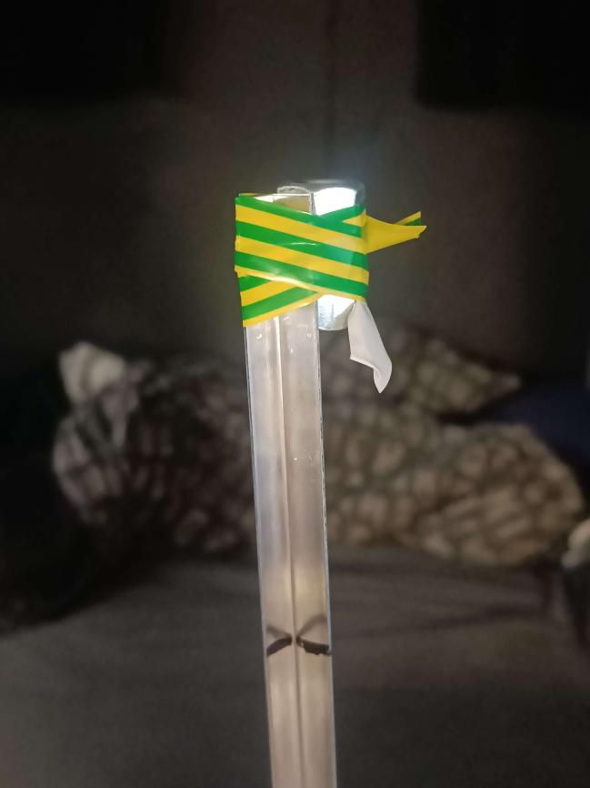{width=60%} -->
<!-- 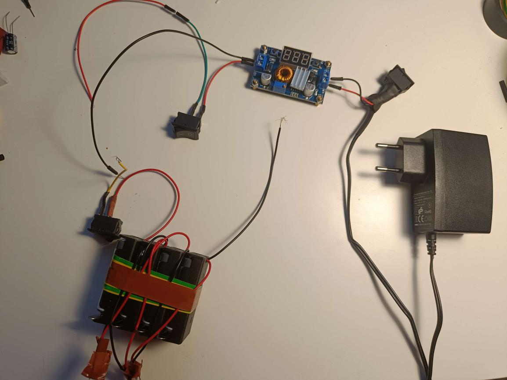{width=60%} -->
<!-- 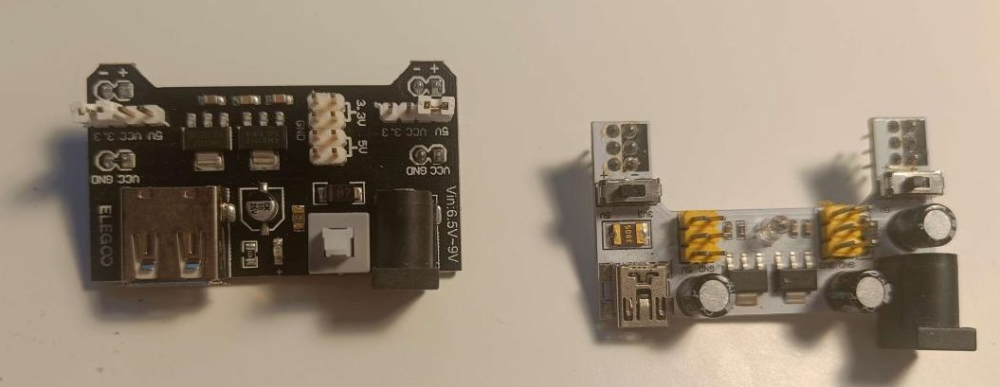{width=60%} -->
<!-- 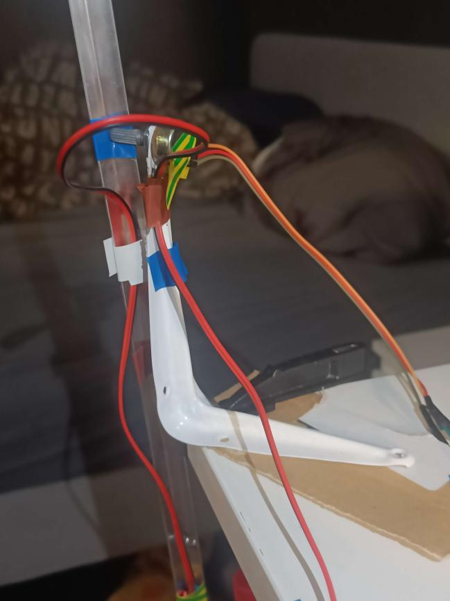{width=60%} -->
<!-- 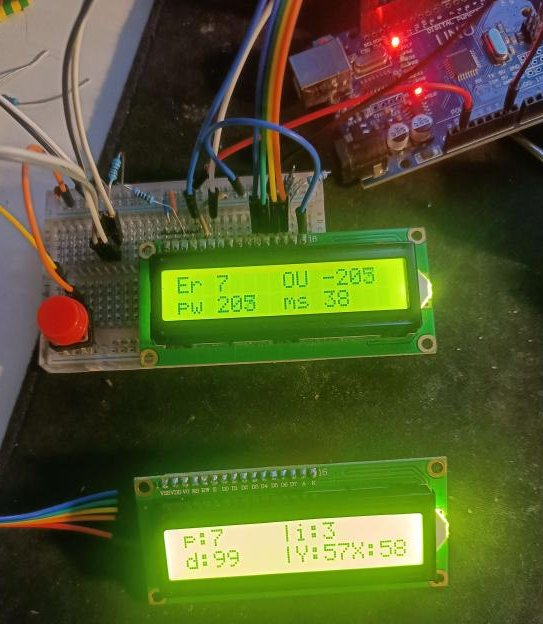{width=60%} -->
<!-- 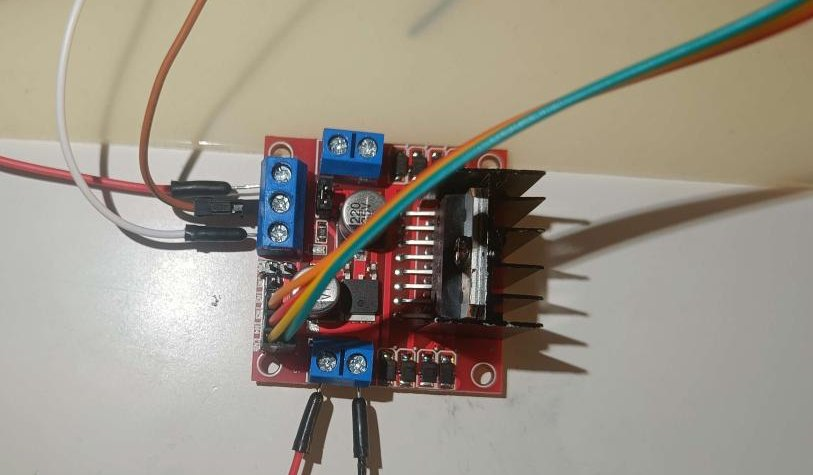{width=60%} -->
<!-- {width=60%} -->
<!-- 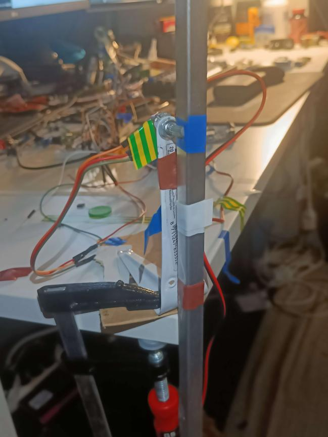{width=60%} -->
<!-- 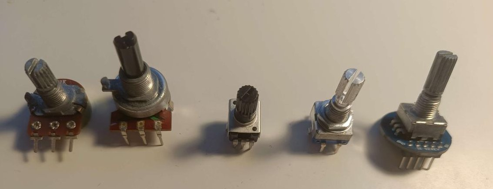{width=60%} -->
<!-- 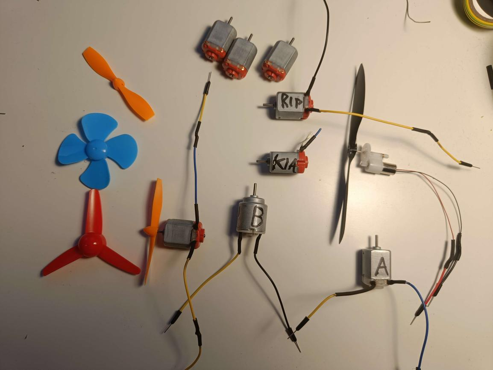{width=60%} -->
<!-- 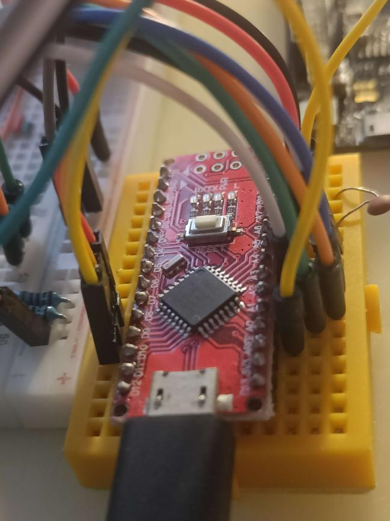{width=60%} -->
<!-- 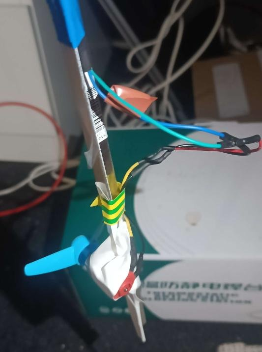{width=60%} -->
<!-- 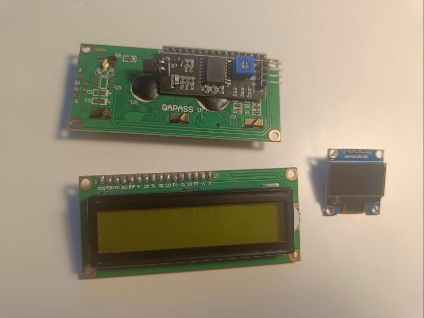{width=60%} -->
<!-- 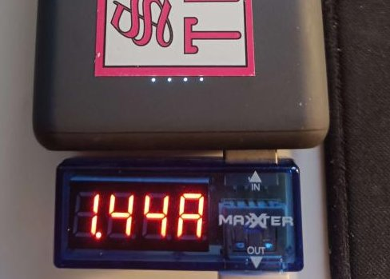{width=60%} -->
<!-- 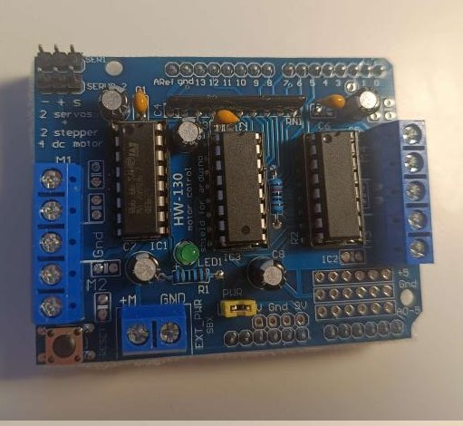{width=60%} -->
<!-- 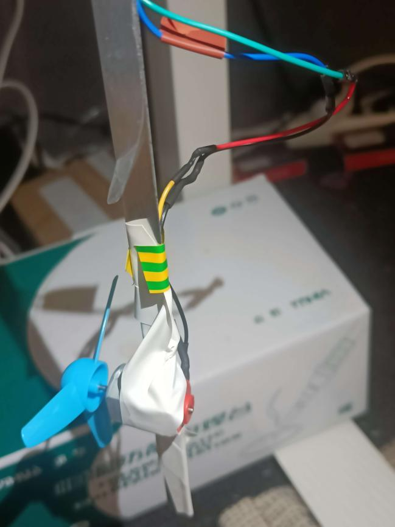{width=60%} -->
<!-- 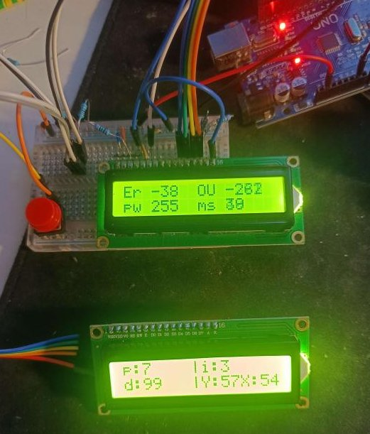{width=60%} -->

## Inspiratie voor mijn Systeem 


In tegenstelling tot de andere twee jaar dat ik dit vak heb geprobeerd te halen en deze opdracht heb geprobeerd te maken, wilde ik het dit keer een compleet vers begin geven. Dus geen balletje op een wipwap van K'NEX en een VL6180X. Hierdoor ben ik op zoek gegaan naar iets wat compleet anders werkte. Tijdens het googelen naar ideeën zag ik de afbeelding die de basis vormde voor dit idee:


```{r, out.width="0.3\\linewidth", include=TRUE, fig.align="center", fig.cap="Inspiratieafbeelding van een Aeropendulum", echo=FALSE}
knitr::include_graphics("./img/2023-08-11-15-56-42.png")
```

Het setpoint zou een hoek zijn ergens op deze rotatie, met het extra moeilijke uitdaging om het de pendulum (door de snelheid van de motor van richting te laten veranderen) precies tegenover de normale evenwitchts situatie te kunnen balanceren.

## Aeropendulum Constructie

De volgende ochtend, na de dag daarvoor online op Amazon/TinyTronics een aantal onderdelen qua elektronica te hebben besteld, heb ik bij de bouwmarkt geen 'carbon fiber rod' kunnen vinden. Wel vond ik een aluminium hoekprofiel van 100 cm, dat verwaarloosbare buiging heeft en maar 115 gram woog.

```{r, out.width="0.3\\linewidth", include=TRUE,fig.show = "hold", fig.align="default", echo=FALSE}


```


Dit lange profiel zou via een Rotary Encoder of Potentiometer, die als as zou dienen, worden verbonden aan deze boekenplankdrager die met een verfklem aan een tafel werd vastgemaakt. Hiervoor moest eerst het gaatje in de boekenplankdrager worden uitgeboord, zodat de potentiometer er doorheen paste en het moertje deze goed kon vastklemmen, zodat de potentiometer niet kon rondraaien. De spleet die in het draaigedeelte zit van de potentiometer klemt (als je wat isolatietape gebruikt) over het hoekprofiel heen. De DC-motor en bedrading werden met isolatietape vastgemaakt aan het profiel.

Voor de Rotary Encoder maakte dit niet uit, aangezien ze ongelimiteerd beide kanten konden opdraaien. Maar de oriëntatie van deze potentiometer ('WL' B10k ~300 graden totale draaiing) moet met de pootjes ongeveer horizontaal zijn, zodat de staaf maximaal zowel voorwaarts als achterwaarts zou kunnen draaien zonder dat die de uiteinden van de potmeter zou raken.

Na testen bleek dit systeem extreem moeilijk in beweging te krijgen. De motor aan of uit zorgen ervoor dat er nauwelijks beweging in kwam.
Door tegengewichten te plaatsen aan de andere kant van het draaipunt. Hiervoor had ik een M12-bout van ~40g en een blokje wolfraam van ~20g; deze kunnen met tape worden bevestigd op verschillen afstanden tot het draaipunt om zo de balans van het systeem te veranderen. 
De locatie van het draaipunt veranderen. Dus in plaats van twee armen van 50 cm naar 70 cm en 30 cm of zoals de inspiratieafbeelding: één arm van 100 cm. 

Hoewel we de langste tijd hebben geprobeerd te werken met de 50 cm armen, en de tegenGewichten (waarvan een aan de arm van de motor) zo gepositioneerd dat het zwaartepunt ongeveer hetzelfde was als het draaipunt, zodat er zo min mogelijk weerstand bestond om de opstelling te laten draaien.
Dit bleek heel moeilijk te zijn voor het PID-systeem, omdat je door de oscillaties en het momentum dat voorbij 90 graden (profiel is horizontaal) kwam, de PID-controller (in combinatie met de geteste motoren) niet op tijd kon afremmen en hierdoor 'over de kop' ging waardoor de draad naar de motor in de knoop kwam.

Hierdoor hebben we in de laatste week voor een stabiel systeem gekozen, waarbij een arm 70 cm lang is met de motor aan het einde, en alleen de moer van 40g als tegenGewicht. Het nettoresultaat van dit systeem was (als het profiel horizontaal stond) een resulterende kracht van 23,5 gram die de motor naar beneden drukte. De statica/dynamica van deze situatie is verder uitgewerkt (door mijn huisgenoten die gelijk wilden krijgen) als bijlage achter in de Appendix.


```{r, out.width="0.3\\linewidth", include=TRUE,fig.show = "hold", fig.align="default", echo=FALSE}


```


Hierdoor kon bij maximale motorvermogen op ongeveer 7.5V (terug gerekend naar de graden van ADC-waarden) ten opzichte van het evenwicht een hoek van -36.2 graden 'voorwaarts' en 17.2 graden 'achterwaarts' bereikt worden. Dit is een totaal van ongeveer 53,4 graden aan setpoints die we kunnen bereiken.
Door momentum kan de hoek wel horizontaal worden, waar het risico van over de kop gaan bestaat, hierdoor is er in de code een 'emergancy stop' implementeerd die boven een bepaalde hoek het motorvermogen op 0 zet en 5 seconden delay aanhoud zodat het systeemw weer tot rust komt.

## Microcontroller Keuze

```{r, out.width="0.3\\linewidth", include=TRUE,fig.show = "hold", fig.align="default", echo=FALSE}


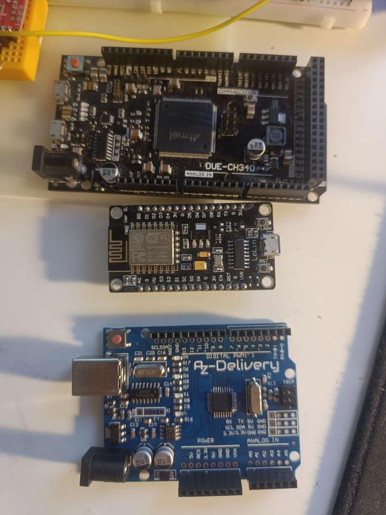
```

### ESP8266
Oorspronkelijk begonnen met een ESP8266 NodeMCU omdat ik deze onlangs nog had gebruikt. Dankzij de ingebouwde netwerkverbinding zou het makkelijk zijn om de PID-waarden via een online dashboard te visualiseren. We zijn hier ver mee gekomen, maar het aanpassen van de PID-waarden bleek lastig omdat de ESP8266 maar één ADC heeft. Hierdoor kunnen er niet gemakkelijk meerdere potmeters worden aangesloten. (delen van deze code zijn nog steeds te vinden in de main branch.)

### Arduino Due
Deze werkte goed totdat deze is doorgebrand. De snelheid was zeker een voordeel; ik meen dat we zonder `Serial.println` een loop-tijd van 7 ms hadden in vergelijking met de huidige 35 ms. Dat deze kapot king bleek achteraf te komen door een defecte of intern kortgesloten PCF8574, waardoor er stroom(~3v 1.5A) op inputs van de Due werd gezet. Als gevolg hiervan wordt de Due nu alleen nog maar heel heet.

### Arduino Uno
Deze had ook goed gewerkt, maar ik gebruikte er al een voor het tweede display en had maar een (korte) USB B-kabel.

### Arduino Nano: Atmega168
De Arduino Nano-clone had vrijwel alle voordelen van de Uno, behalve dat ik hier meer exemplaren(mocht ik er meer laten doorbranden) van had en een lang genoege USB-kabel, en werd hierdoor de keuze voor de rest van de ontwikkeling.


## Potentiometers en Andere Sensoren

```{r, out.width="0.6\\linewidth", include=TRUE,fig.show = "hold", fig.align="default", echo=FALSE}

```

Voordat ik gebruikmaakte van de tegengewichten waren de potmeters niet echt geschikt voor dit systeem. Ze hadden intern te veel weerstand in termen van newtonmeter voor draaiing (niet in ohm) om door onze motor bewogen te worden, die op dat moment ook incorrect werd aangestuurd. Hierdoor heb ik eerst als as van de pendulum een rotary encoder gebruikt, die veel minder interne weerstand heeft. Dit werkte op zich goed, behalve dat de pendulum elke keer tijdens het instellen een kalibratieproces moest ondergaan zodat de rest van de code wist wat de 0-stand equilibrium zou zijn. Soms verloor de encoder ook zijn telling. Het grootste probleem was dat het PID-systeem hier niet goed genoeg op kon functioneren. De twee rotary encoders die ik had, hadden slechts 24 posities, waardoor het voor het PID-systeem moeilijk was om precies te weten waar het zich bevond.

Ik had een 'sub-angle'-systeem in ontwikkeling dat op basis van verandering in snelheid (tijdmeting tussen verschillende rotary encoder-veranderingen) probeerde om te zetten naar een geschatte positie tussen de twee rotary encoder-posities, de 'sub-angle'. Maar dit was onbegonnen werk.
Ook heb ik overwogen om een acceleraometer /gyroscope zoals de MPU6050 of GY-61 (die ik thuis had liggen) toe te voegen aan een van de eindes van het profiel, dit zou helpen met de nauwkeurigheid van de sub-angle, en de gyroscope zorgde er voor dat er niet gewacht moest worden op het 0-moment  voor kalibreren. Dit allemaal toegevoeggen zou veel extra werk en complexiteit zijn dus ben ik hierna gaan kijken  of ik niet meer koppel/kracht  kon genereren om de potentiometer te laten werken. De potentiometer heeft ten opzichte van de 24 posities van de rotary encoder 1023 posities (4095 op de Due) en vereist geen kalibratie.

\pagebreak

## PID-Tuning: Input 

Om de scalars—de Kp, Ki en Kd waarden in de formule \(Kp \times \text{error} + Ki \times \text{integral} + Kd \times \text{derivative}\)—tijdens runtime aan te passen, heb ik drie extra potentiometers toegevoegd. Er is ook een potentiometer beschikbaar voor het instellen van de setpoint (de doelhoek) van het regelsysteem.

Tijdens het prototypen van scalaradjustment via websockets op de ESP8266 was ik al heel inefficient bezig met het tunen van het regelsysteem. Ik wist dus dat de waarden voor Kp, Ki en Kd niet simpelweg een vaste combinatie zoals Kp=2, Ki=3 en Kd=0 zouden zijn; er zou een significant verschil tussen deze parameters moeten zijn. Om deze aanpassingen tijdens runtime te kunnen maken, heb ik gebruikgemaakt van een NXP PCF8574AP, een 8-bit I/O Expander met i2c-interface, die me 8 extra inputs gaf. Daarvan hebben we er 6 gebruikt: twee voor elke potentiometer. Deze inputs gaven elke potentiometer 2 bits, wat resulteerde in de mogelijkheid om één van de 4 verschillende 'multipliers' te selecteren.

```{r, out.width="0.3\\linewidth", include=TRUE,fig.show = "hold", fig.align="default", echo=FALSE}
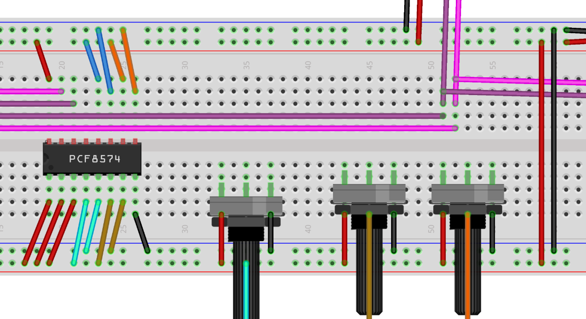
```


Bijvoorbeeld, in de Fritzing-afbeelding zijn er cyan, bruin en oranje jumperdraden aangesloten op de PCF8574; deze kleuren komen overeen met een van de drie potentiometers die er rechts naast staan. De posities van deze jumperdraden kunnen binair worden uitgedrukt als 00, 01, 10, of 11. Als de code gecompileerd zou zijn met `const int SensitivityMultipliers[] = {1,10,20,50}`, dan zou dit betekenen dat elke parameter (Kp, Ki, Kd) onafhankelijk kan worden aangepast binnen bereiken van 0-1023, 0-10230, 0-20460, of 0-51150.

Deze setup zorgt ervoor dat ik zowel de positie van de potentiometers als de jumperdraden fysiek kan aanpassen, en dat deze instellingen bewaard blijven, zelfs bij stroomuitval of reset van de Arduino. Hierdoor zijn alle inputwaarden voor het PID-systeem (scalars, setpoint en de hoek van het systeem) non-volatile en direct gekoppeld aan een fysieke eigenschap. Dit maakt het mogelijk om relatief deterministisch gedrag te krijgen, vooral nuttig bij het debuggen van 'underflow' of 'overflow' bugs, mits de pendulum stil staat (d.w.z. de as is ontkoppeld van het profiel).

Alle code voor het instellen van deze 5 waardes is samegevoegd mijn eigen library `src/PotManager.h`.

## Displays


Aanvankelijk was het mijn bedoeling om via de ESP8266 invoerwaarden te visualiseren op een webpagina met grafieken die waarden over tijd weergeven. Echter, vanwege veranderingen in de hardwarekeuze, ben ik uiteindelijk overgeschakeld op twee 1602 LCD-displays. Dit was ook noodzakelijk omdat mijn SSD1306 OLED-display kapot was. Voor een van de twee 1602-displays heb ik een I2C-'backpack' gesoldeerd die een interne PCF8574-chip bevat. Daardoor kon het display via I2C worden aangestuurd, een interface die ik al gebruikte voor mijn eigen I/O-uitbreiding, en dus perfect uit kwam.

```{r, out.width="0.3\\linewidth", include=TRUE,fig.show = "hold", fig.align="default", echo=FALSE}
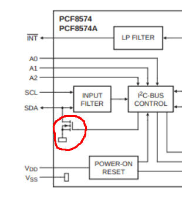

```

Ondanks dat de PCF8574A-chips interne pull-upweerstanden hebben, ondervond ik problemen bij het aansluiten van een tweede apparaat op dezelfde I2C-bus. Daarom heb ik zowel de SDA- als de SCL-lijnen met een 10k ohm weerstand naar de 5V getrokken. Daarmee werd een stabiele communicatie met beide apparaten mogelijk.

Het 1602-display biedt 32 karakters, wat voldoende was om de invoerparameters voor het PID-systeem weer te geven. Om echter ook inzicht te krijgen in de interne werking en outputwaarden van het systeem, was een tweede 1602-display noodzakelijk. Om niet tegelijkertijd de libraries #include `<LiquidCrystal_I2C.h>` en `<LiquidCrystal.h>` te hoeven gebruiken, heb ik ervoor gekozen om het tweede display ook via I2C aan te sturen. Dit werd gerealiseerd met behulp van een tweede Arduino Uno die als I2C-slave functioneert. Deze Arduino toont waarden die het via de I2C-bus ontvangt op het display.

```{r, out.width="0.5\\linewidth", include=TRUE,fig.show = "hold", fig.align="default", echo=FALSE}


```

De zelfgeschreven code voor deze I2C-slave is te vinden in LCD1602Slave/LCD1602Slave.ino. De master kan dit aansturen met LCD1602SlaveController.h, een meer gestroomlijnde library die alleen de benodigde char* of ints doorstuurt om te worden weergegeven op het tweede display. Net als de eerste I2C-verbinding, is ook deze tweede verbinding uitgerust met twee 10k pull-upweerstanden. Op dit zelfde breadboard is een push button knop die de RESET pin van de Arduino naar Ground trekt, dit was handig als de arduino vast liep terwijl het motorvermogen aan stond op dat moment.


De getoonde waardes op de displays bestaat uit: (en de range van mogelijk waardes die ze kunnen laten zien, zowel als het corresponderende interne dataype) 

### Display PotManager:
* p:0-65,535: Dit is de Kp waarde voor het PID regelsysteem, uint16_t.
* i:0-65,535: Dit vertegenwoordigt de Ki waarde, uint16_t.
* d:0-65,535: Hier wordt de Kd waarde getoond, uint16_t
* Y:0-99: Dit is de actuele positie van de pendulum. Hoewel het display slechts waarden tussen 0 en 99 toont, wordt intern een nauwkeuriger 10-bits meting (0-1023) gebruikt.
* X:0-99: Dit is het ingestelde setpoint voor het PID-systeem. Net als bij de pendulumpositie wordt intern een 10-bits waarde (0-1023) gebruikt voor meer nauwkeurigheid.

### Display i2cSlave:
* Err: -999-9999: Dit is het verschil tussen de gelezen ADC-waarden van het setpoint en de positie van de pendulum. Deze waarde is ongeveer (X−Y)×10.2 en wordt als een signed int opgeslagen.
* Out: -999-9999: Dit is het resultaat van de PID-berekening, oftewel de gewenste output van het regelsysteem. Intern wordt dit opgeslagen als een signed long.
* pw: 0-255: Dit geeft de duty cycle van het PWM-signaal aan de motor aan, uitgedrukt in een 8-bits getal.
* ms: 0-9999: Dit toont de tijd in milliseconden die elke systeemlus duurt. Intern wordt dit opgeslagen als een long.

Door deze waarden op de displays te tonen, krijk ik een gedetailleerd en real-time overzicht van het systeem, wat waardevol is voor zowel diagnose als het tunen van het PID systeem.


## Motoren en propellors


Voor dit project had ik de keuze uit vier verschillende motoren en drie soorten propellers. Hier volgt een gedetailleerde beschrijving van mijn bevindingen en uiteindelijke keuzes.

### Soorten Motoren:
* \textbf{Motor A}: Gewicht is 14g.
* \textbf{Motor B}: Gewicht is 15g.
* \textbf{Motor R} (met een rode achterkant): Gewicht is 17g. Ik had 10 stuks van deze motor.

### Selectern van Propeller:

Ik heb de propellers getest met Motor R bij een spanning van 5.5V. Door de motor omgekeerd aan een weegschaal te bevestigen, kon ik de stuwkracht als een negatief getal meten:

* \textbf{2-blads}: -1.8g
* \textbf{3-blads}: -2.3g
* \textbf{4-blads}: -1.9g

Op basis van deze resultaten(niet opgemeten maar de 3-blad propeller leek het ook beter te doen op de andere 2 motor types) koos ik voor de 3-blads propeller vanwege zijn hogere stuwkracht in deze RPM-range.


```{r, out.width="0.5\\linewidth", include=TRUE,fig.show = "hold", fig.align="default", echo=FALSE}

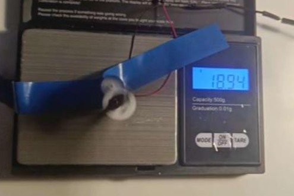
```


### Thrust metingen:

* \textbf{Motor A} : Produceerde -2.9g met de 3-blads propeller.

* \textbf{Motor B}: Produceerde -1.1g (onbruikbaar vanwege excessieve vibratie en lage snelheid).

* \textbf{Motor B}:Motor R: -2.3g met de 3-blads propeller.

### Speciale Overweging - 8520 Drone Motor:

Ik heb ook een 8520 drone-motor gekocht om de draaiweerstand van de potentiometers te overwinnen. Deze motor weegt slechts 8g (inclusief versnellingsbak en een 15cm propeller) en produceert meer dan 20g stuwkracht. Hoewel indrukwekkend, bleek deze motor niet geschikt voor mijn PID-systeem. Het reageerde pas bij een PWM duty cycle van ongeveer 50% en vertoonde daarna een niet-lineaire respons. De andere motoren begonnen mestal met heel langzaam te draaien vanaf ~15% duty cycle.

### Duurzaamheid en Eindkeuze:

Bij langdurige en frequente richtingsveranderingen tijdens PID-tests kunnen motoren beschadigd raken, vooral hun koolborstels. Hoewel Motor A lichter is en meer stuwkracht biedt, heb ik gekozen voor Motor R vanwege de beschikbaarheid en vervangbaarheid. Gedurende de tests heb ik vier Motor R-eenheden gebruikt, waarvan er twee uiteindelijk defect raakten en één nu stroef loopt.


## Motor Divers 

Ik heb de enige twee DC motordrivers aangeschaft op TinyTronics dit waren de L298N en de L293D.


De L298N vereist een spanning van 5-35V DC voor de motoren en kan maximaal 2A leveren voor elk van zijn twee uitgangen. Daarentegen heeft de L293D een spanning nodig van 5-12V DC en kan slechts maximaal 600mA per uitgang leveren. Omdat onze besturingskaart twee van deze L293D-drivers bevatte, in combinatie met een shiftregister, kon het in totaal drie motoren aansturen.

Vanwege de beperkte stroomcapaciteit van de L293D koos ik voor de L298N, die een maximale output van 2A per uitgang kan leveren. Een uitdaging met de L298N was de merkbare spanningsval van ongeveer 2V. Onze oorspronkelijke voedingsbron van een 5V 2A USB-voeding bleek onvoldoende, waardoor we moesten overstappen op een voeding met een hogere spanning.

```{r, out.width="0.35\\linewidth", include=TRUE,fig.show = "hold", fig.align="default", echo=FALSE}


```


Wat betreft de controle voor de driver heeft de L298N drie belangrijke pinnen voor elke motoruitgang: ENable, IN_1, en IN_2. Door een PWM-signaal naar de EN-pin te sturen, kun je de snelheid van de motor regelen. De IN_1 en IN_2 pinnen bepalen vervolgens de draairichting. Ik had achteraf een defecte chip of PCB waarbij de IN_2 inpit van Output A niet was aangesloten intern waardoor de PWM-besturing slechts in één richting werkte voor motor A. Dit probleem werd (na enige tijd en veel frustratie) opgelost door simpelweg de andere motoruitgang te gebruiken.

Tijdens dit proces hebben we ook de L293D motorshield getest, maar deze kon zoals verwacht niet voldoende stroom leveren. Ik heb ook overwogen om MOSFETs en condensatoren te gebruiken om zo zelf mijn motor te driven, maar deze optie bleek inefficiënt en beperkt in functionaliteit omdat we ook PNP-transistors nodig zouden hebben voor een volledige H-bridge, die nodig is om de motor twee kanten op te kunnen laten draaien. 


## Stoomtoevoer

### Verhogen Spanning

Vanwege de merkbare spanningsval van ongeveer 2V bij de L298N heb ik nu een minimale voedingsspanning van 7V nodig. Aanvankelijk gebruikten ik een serie van acht AA-batterijen(13.5v-10.5v). Hoewel dit werkte, liepen de batterijen snel leeg vanwege de hoge stroom die de motor verbruikte. Deze exacte DC motor-stroomwaarde kon ik nooit echt meten omdat mijn multimeter een maximale capaciteit van 500mA heeft en  ik geen geschikte shuntweerstand(<10 Ohm) had.

Om dit probleem op te lossen, schakelden we over naar een step-down buck-converter (XL4015) met een capaciteit van 4A en een ingebouwd display. Dit stelde ons in staat de in- en uitgangsspanningen te monitoren en aan te passen met een potentiometer. Om een stabiele uitgangsspanning van 5,5V te behouden, was nu een ingangsspanning van 9V vereist. Na het verbruiken van 16 AA-batterijen, vonden we een oude 12V, 1,5A DC-adapter van een router. We verwijderden de stekker en soldeerden er jumperdraden aan.

### Elektrickery 
Tijdens het gehele PID proces zijn we diverse problemen tegengekomen, waaronder het onstabiel functioneren van de Arduino-boards en tegelijkertijd knipperen van mijn computermonitor waneer ik de arduino reset, waarschijnlijk wegen raare groundloops en het feit dat die op dezelfde elektrische groep was aangesloten. Om deze problemen te verhelpen, hebben we eerst ontkoppelingscondensatoren van 100 pF toegevoegd, bedoeld voor hogere frequenties. Dit bleek niet effectief, waarna we voor lagere frequenties condensatoren van 22nF toevoegden, die wel leken te helpen met stabielteit.

Ten slotte hebben we ervoor gekozen om het gehele PID-systeem — inclusief displays en invoerapparaten — te laten functioneren zonder USB- of pc-verbinding om de storingsgevoeligheid te minimaliseren. Deze aanpassing bleek succesvol.

```{r, out.width="0.40\\linewidth", include=TRUE,fig.show = "hold", fig.align="default", echo=FALSE}


```


### USB-Stroomproblemen

Tijdens het instellen van de PID-waarden ging onze PCF8574-chip defect. Dit resulteerde in een kortsluiting die de Arduino (aangesloten via USB op mijn computer) ertoe aanzette om tijdelijk een stroom van ~5.15V en 1.4A te trekken. Mijn computer reageerde hierop door alle USB-apparaten tijdelijk los te koppelen om overbelasting te voorkomen, zoals bleek uit de kernel-logbestanden.


```
Aug 22 20:19:04.564401 fenrir kernel: usb usb2-port1: over-current condition
Aug 22 20:19:04.587431 fenrir kernel: usb usb1-port1: over-current condition
Aug 22 20:19:04.587641 fenrir kernel: usb 1-1: USB disconnect, device number 2
Aug 22 20:19:04.587672 fenrir kernel: usb 2-1: USB disconnect, device number 7
```

Dit probleem was moeilijk te diagnosticeren totdat we een USB-spanning- en stroommeter gingen gebruiken, gekoppeld aan een powerbank om te voorkomen dat de Arduino uitviel. We hebben toen de bedrading een voor een losgemaakt om het probleem te isoleren. Na het oplossen van dit issue hebben we de schaalfactoren voor de PID-regeling handmatig tijdens de compilatietijd ingevuld, zodat deze niet meer aanpasbaar waren tijdens de uitvoering.

De combinatie van hardwareaanpassingen en de loskoppeling van de PID-opstelling van de USB- en pc-verbindingen heeft bijgedragen aan een aanzienlijk stabieler en betrouwbaarder systeem.


<!--                                                                                            -->
<!--                                                                                            -->
<!--                                                                                            -->
<!--                                                                                            -->
<!--                                                                                            -->

\newpage

# Software 

##  PID Performance
Met de PID-waarden van Kp=10 (bereik 6-12), Ki=4 (bereik 1-5) en Kd=90 (bereik 85-98) kan het systeem snel (binnen circa 1 seconde) en nauwkeurig een hoek tussen 36.2 en -17.2 graden ten opzichte van het evenwicht (0.0 graden) bereiken. Dit gebeurt met minimale overshoot en bounce/oscillatie. De grootste uitdaging voor het PID-systeem—vooral de 'D'-term—zit in de transitie van het ene uiteinde van het bereik naar het andere (van 36 naar -17 graden). Dit komt omdat het systeem dan moet compenseren voor zowel het gewicht en het momentum als voor de P- en I-termen, die in deze fase geen corrigerende werking hebben.

Hoewel mijn oorspronkelijke plan om een pendulum op 180 graden van zijn evenwicht te balanceren niet is geslaagd, geloof ik dat dit met de huidige hardware onmogelijk is zonder aanpassingen, zoals bijvoorbeeld een tweede motor. Desondanks functioneert het PID-systeem nog steeds goed met dezelfde scalars, zelfs als ik de Savitzky-Golay-filtering uitschakel.

## Tunen van Lineaire en Niet-lineaire Uitdagingen
Het afstellen was een tijdrovend proces, voornamelijk vanwege aanhoudende hardwareproblemen en bugs. De Inputs en opzet van het system om mee te tunen van het systeem heel goed werkte, werd bemoeilijkt nadat de PCF8574 defect raakte. Het complete systeem bleek bij het zwaartepunt en draaipunt (~50 cm) extreem instabiel te zijn. De motor was simpelweg niet krachtig genoeg om het natuurlijke momentum effectief te compenseren.

Traditionele methoden voor PID-tuning, zoals de b.v. Ziegler–Nichols-methode, bleken niet behulpzaam. Deze methoden beginnen vaak met Ki en Kd op nul en zijn ontworpen om een oscillatie in het systeem te creëren via de Kp-term, om zo de ultieme versterking \textit{Ku} te vinden. In de context van ons pendulum was dit problematisch. Zonder een significante demping (Kd) aan het begin, was het vrijwel onmogelijk om de output te laten oscilleren zonder dat de pendulum over de kop ging of de limieten van de potentiometer bereikte. De huidige waardes zijn het resultaat van uren lang trial en error, als er niks in die tijd kapot ging.

Pas nadat ik de pendulum zo veel mogelijk liet gedragen als een eenvoudig lineair systeem—door het minimaliseren van niet-lineaire effecten—werd(zwaam maken aan een kant, draaipunt verschuiven van 50cm naar 70cm etc.) werd het tunen enigszins beheersbaar. Dit brengt ons bij het fundamentele probleem van het tunen van een systeem dat in essentie niet-lineair is.

## Over het Gedrag van een Echt Pendulum
Een pendulum met echte massa en momentum gedraagt zich bij grote hoekafwijkingen niet als een simpel lineair systeem. De relatief makkelijke formule $m⋅g⋅θ$ is dan niet meer voldoende om het gedrag te beschrijven. Dit komt omdat niet-lineaire effecten, zoals de zwaartekracht en de aerodynamische krachten van de propeller, een steeds grotere rol gaan spelen. Vooral wanneer er een motor of propeller aan het uiteinde van de pendulumstaaf is gemonteerd, wordt het gedrag van het systeem sterk beïnvloed door de dynamische interactie tussen de aerodynamische krachten en de mechanische eigenschappen van het pendulum. Dit maakt het des te uitdagender om het systeem effectief te regelen met een eenvoudige PID-regelaar.

Dus, het echte obstakel in het tunen was het inherent niet-lineaire gedrag van de pendulum, wat traditionele lineaire PID-tuning methoden inadequaat maakte voor deze toepassing. Het vereiste aanpassingen en improvisaties om het systeem in een zo lineair mogelijke staat te brengen voor effectieve regeling.


## Software Ontwerp Totaal

Het onderstaande diagram illustreert de relaties tussen de requirements van elk bestand. Hierin zijn de externe arduino libraries `Wire`, `LiquidCrystal` en `LiquidCrystal_I2C` opgenomen om hun belang in de structuur van het systeem aan te geven. Voor de rest bestaat de software uit 3 delen:

1. LCD1602 Slave Controller
De bestanden LCD1602SlaveController.cpp en LCD1602SlaveController.h vormen het LCD1602 Slave Controller gedeelte van het systeem. Deze hebben een afhankelijkheid van de Wire-bibliotheek voor I2C-communicatie. Deze module fungeert als een tussenpersoon voor de aansturing van een LCD1602 display via de I2C-interface.
    - \textit{Het bestand LCD1602Slave.ino wordt beschouwd als een afzonderlijk apparaat dat alleen is verbonden via de I2C-interface. Daarom is het  in een andere kleur opgenomen in de diagram. Deze slave fungeert als een zelfstandige eenheid die communiceert met de hoofdeenheid via I2C.}

2. PotManager
De bestanden PotManager.cpp en PotManager.h beheren de potentiometerinvoeren. Ze zijn afhankelijk van meerdere bibliotheken: Wire voor I2C-communicatie, LiquidCrystal_I2C voor de interface met het LCD-display, PCF8574 voor extra I/O-mogelijkheden en de standaard Arduino-bibliotheek voor algemene functionaliteiten. Deze module zorgt voor de afhandeling en eventuele schaling van analoge invoer van verschillende potentiometers.

3. AirPendulum
Het bestand airpendulum.ino is het hoofdscript van het project. Dit script heeft afhankelijkheden van zowel LCD1602SlaveController.h als PotManager.h en maakt ook gebruik van de Wire en Arduino bibliotheken voor diverse taken. Dit is het centrale punt waar alle modules samenkomen en waar de hoofdlogica van het project is geïmplementeerd.

```{r figure_ontwerp, echo = FALSE, fig.align='center', fig.cap = "Relaties Tussen de verschillende onderdelen van de software"}
grViz("

digraph G {
    rankdir=TB;
  
    // Define nodes
    airpendulum [label='airpendulum.ino', shape=box];
  
    LCD1602SlaveControllerH [label='LCD1602SlaveController.h', shape=box];
  
    PotManagerH [label='PotManager.h', shape=box];
  
    LCD1602SlaveIno [label='LCD1602Slave.ino', shape=box, color=blue];
  
    WireLib [label='Wire Library', shape=ellipse];
    ArduinoLib [label='Arduino Library', shape=ellipse];
    LiquidCrystalLib [label='LiquidCrystal Library', shape=ellipse];
    LiquidCrystalI2CLib [label='LiquidCrystal_I2C Library', shape=ellipse];
    PCF8574Lib [label='PCF8574 Library', shape=ellipse];
  
    // Define relationships
    LCD1602SlaveControllerH -> WireLib;
    LCD1602SlaveControllerH -> ArduinoLib;
  
    PotManagerH -> WireLib;
    PotManagerH -> LiquidCrystalI2CLib;
    PotManagerH -> ArduinoLib;
    PotManagerH -> PCF8574Lib;
  
    airpendulum -> LCD1602SlaveControllerH;
    airpendulum -> PotManagerH;
    airpendulum -> WireLib;
    airpendulum -> ArduinoLib;
  
    // Relationships for LCD1602Slave.ino
    LCD1602SlaveIno -> WireLib [color=blue];
    LCD1602SlaveIno -> LiquidCrystalLib [color=blue];
}
")
```


## AirPendulum 
Het bestand airpendulum.ino is het hoofdscript van het project. Dit script heeft afhankelijkheden van zowel LCD1602SlaveController.h als PotManager.h en maakt ook gebruik van de Wire en Arduino bibliotheken voor diverse taken. Dit is het centrale punt waar alle modules samenkomen en waar de PID Controller is geïmplementeerd.


### PID loop 

Bestaat uit :

* Proportionele Term (Kp * error): Deze term probeert de huidige fout te verminderen door een correctie te maken die evenredig is met de huidige fout.

* Integrale Term (Ki * integral): Deze term probeert de cumulatieve fout over tijd te verminderen.

* Derivatieve Term (Kd * derivative): Deze term probeert toekomstige fouten te voorspellen en te corrigeren door naar de verandering van de fout te kijken.

De som van deze drie termen vormt de output van de PID-regelaar:
```c
long output = (Kp * error + Ki * integral + Kd * derivative) / 10; // Schaal factor van 10
```

```{r figure_APmain, echo = FALSE, fig.align='center', fig.cap = "FlowChart van de main Arduino airpendulum PID loopDiagram of the Main Arduino Sketch Workflow" }

grViz("
digraph PIDFlowchart {
    subgraph cluster1 {
      rankdir=LR;
      start [label = 'Start PID Loop']
      calcError [label = 'Lees alle PotMeters']
      addIntegral [label = 'Calculeer error \n Voeg error toe aan integral\n Pas Anti-windup aan']
      calcDerivative [label = 'Calculeer derivative']
      calcOutput [label = 'Calculeer output']
      calcPwmValue [label = 'Calculeer pwmValue en motorTurnDirection']
    
      start -> calcError
      calcError -> addIntegral
      addIntegral -> calcDerivative
      calcDerivative -> calcOutput
      calcOutput -> calcPwmValue
    }

    subgraph cluster2 {
      rankdir=RL;
      checkAngle [label = 'Is de hoek te hoog?']
      emergencyStop [label = 'Emergency Stop: Zet motor op 0 en wait 5000 ms']
      resetMotorState [label = 'reset Integral en restart loop.']
      setMotorState [label = 'Zet motorstate gebaseerd op PID output']
      updateError [label = 'Update lastError']
      end [label = 'Einde PID Loop']
      
      calcPwmValue -> checkAngle
      checkAngle -> setMotorState [label = 'No']
      checkAngle -> emergencyStop [label = 'Yes']
      emergencyStop -> resetMotorState 
      resetMotorState -> end 
      setMotorState -> updateError
      updateError -> end
    }
}
")
```

#### Integral Windup en Anti-windup
In PID-regeling is de integral term verantwoordelijk voor het verminderen van de constante fout die overblijft nadat de proportionele term zijn werk heeft gedaan. Echter, zonder een soort van beperking kan deze integral term uit de hand lopen, vooral bij een grote of aanhoudende fout. Dit fenomeen staat bekend als "integral windup".

Om te voorkomen dat de integral term onbeheersbaar wordt, worden boven- en ondergrenzen ingesteld. Dit is wat de regels `if (integral >/< MIN/MAX_INTEGRAL) integral = MAX_INTEGRAL;` Ze zorgen ervoor dat integral binnen een vooraf bepaald bereik blijft. Dit wordt ook wel anti-windup genoemd en het helpt bij het stabiel houden van het systeem. Zo ontstaan er geen over or underflows als het systeem lange tijd niet dichter bij zijn setpoint kan komen.

#### Schaal Factor
Zoals te zien aan het einde waat wij \textbf{output} berekenen, delepen wij deze waarde door 10. Dit is een schaalfactor die helpt om de grootte van de output te beheren zonder floating-point berekeningen te gebruiken. Omdat dit script integers gebruikt in plaats van floating-point getallen, kan het veel efficiënter zijn qua geheugen en verwerkingssnelheid. Dit is van cruciaal belang voor systemen met beperkte resources zoals een Arduino.

#### 
Ondanks dat we Millis() en elapsed time gebruiken voor het berekenen van de loopTime, is in dit specifieke geval gekozen voor een eenvoudige PID-regelaar zonder de dt (delta tijd) term. Dit is voldoende, en verder hadden we veel vaker bug en undefined behavior op de arduino Nano/Uno bij gebruik van deze dt manier van PID controll. Het weglaten van dt vereenvoudigt de berekeningen en maakt het gebruik van integers, en zoals eerder gezegd, gunstig is voor beperkte systemen zoals een Arduino.

Door deze drie elementen—anti-windup, schaalfactor en het weglaten van dt—kunnen we een efficiënte en effectieve PID-regeling implementeren die geschikt is voor embedded devices.


## LCD 1602 Slave and Master

Het block diagram illustreert een eigen implementatie van I2C-communicatie tussen een Master en een Slave voor het beheren van LCD 1602 displays. In de Slave-component wordt de receiveEvent methode getriggerd door I2C-communicatie, wat leidt tot de uitvoering van óf init4 óf update4, afhankelijk van het ontvangen commando. Het doel van deze architectuur is om een tweede LCD 1602 display te kunnen aansturen via de bestaande I2C-verbinding.


```{r figure_z45, echo = FALSE, fig.align='center', fig.cap =  " Block Diagram van de LCD1602 Slave en LCD1602Master (LCD1602SlaveController.h) " }
grViz("
digraph {
    newrank=true;

    Master -> I2C_Communication [label='begin1602slave']
    Master -> I2C_Communication [label='update1602slave']
    Master -> I2C_Communication [label='update1602slave (int version)']
    I2C_Communication -> Slave [label='I2C Communication']

    subgraph cluster_Master {
        label='Master'
        Master_Constructor [label='Constructor']
        begin1602slave [label='begin1602slave']
        update1602slave_str [label='update1602slave(str)']
        update1602slave_int [label='update1602slave(int)']

        Master_Constructor -> begin1602slave
        begin1602slave -> update1602slave_str
        begin1602slave -> update1602slave_int
    }

    subgraph cluster_Slave {
        label='Slave'
        Slave_Setup [label='setup']
        Slave_Loop [label='loop']
        receiveEvent [label='receiveEvent']
        init4 [label='init4']
        update4 [label='update4']

        Slave_Setup -> Slave_Loop
        Slave_Loop -> receiveEvent
        receiveEvent -> init4 [label='Command I']
        receiveEvent -> update4 [label='Command U']
    }
}
")
```


## PotManager Class Architecture

```{r figure_potmanager, echo = FALSE, fig.align='center', fig.cap = "Block Diagram van de PotManager Class" }

grViz("
digraph {
    newrank=true;
    node [shape=box]
    edge [arrowhead=open]

    // Class Name
    Class_Name [label='PotManager Class']

    // Constructor and Methods
    Constructor [label='PotManager(int* LCDPotInput, int multipliers[])']
    Begin [label='begin()']
    DebugPrint [label='debug_print()']
    UpdateDisplay [label='updateAndDisplay()']
    GetScaledValues [label='getScaledValues(int result[4])']
    MapSensitivity [label='mapSensitivity(bool s1, bool s2)']

    // Data Members
    LCDPotInput [shape=ellipse, label='LCDPotInput']
    Multipliers [shape=ellipse, label='multipliers']
    ScaledPotValues [shape=ellipse, label='scaledPotValues']

    // Relationships
    Class_Name -> Constructor
    Constructor -> LCDPotInput
    Constructor -> Multipliers
    Class_Name -> Begin
    Class_Name -> DebugPrint
    Class_Name -> UpdateDisplay
    Class_Name -> GetScaledValues
    Class_Name -> MapSensitivity

    Begin -> ScaledPotValues
    UpdateDisplay -> ScaledPotValues
    UpdateDisplay -> LCDPotInput
    GetScaledValues -> ScaledPotValues
    DebugPrint -> ScaledPotValues
    DebugPrint -> Multipliers
    DebugPrint -> LCDPotInput
    MapSensitivity -> Multipliers

}
")
```

## Digital filtering: 

Voor de digitale filtertechniek heb ik gekozen voor Savitzky-Golay. Grotendeels omdat ik voor mijn scriptie ook te maken heb gehad met filtering van ruis op runtime-constrained real-time systemen met een lage sensor poll rate. (In dat geval ging het over het 'smoothen' van helderheidsregio's uit videobeelden; de frametijd daar was rond de 33 ms(30fps), dus vergelijkbaar met dit systeem.) Savitzky-Golay werkt met twee parameters: de windowSize en de polynomiaal. De windowSize is simpelweg de hoeveelheid datapunten die gebruikt wordt voor het filteren. Door de verhouding tussen windowSize en de polynomiaal te veranderen, kun je meer of minder 'smoothing' toepassen. Een voordeel van Savitzky-Golay over bijvoorbeeld een moving average is dat er geen signaalresolutie verloren gaat bij het verwijderen van ruis.

* Door te kiezen voor een polynoom van orde 0 hebben we eigenlijk gewoon een moving average filter.
* Bij een polynoom van orde 1 wordt een lineaire regressie toegepast over de windowSize.
* Vanaf een polynomiaal van orde 2-3 (in combinatie met hogere windowSizes) begint het filter heel goed te werken om veel 'noise' te verwijderen.

Echter, voor een polynomiaal van orde 2 of hoger, wordt de berekening een stuk complexer. Boven de 2e orde wordt het onhaalbaar om deze berekeningen (met floating-point precisie) snel genoeg uit te voeren op embedded hardware, zonder dat dit de poll rate (en dus de effectiviteit van het PID-systeem) naar beneden brengt.

Daarom heb ik een Savitzky-Golay filter geïmplementeerd in C++ voor Arduino, dat alleen met integers werkt voor een polynomiaal van 0, 1, en 2. Dit is voldoende voor deze PID-use-case, omdat kleine afrondingsfouten door het systeem zelf kunnen worden opgevangen.

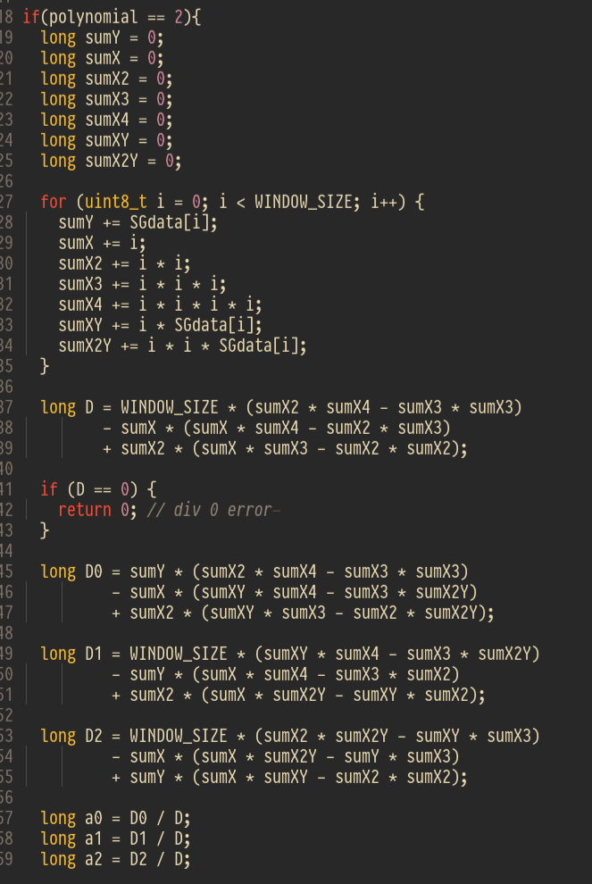{width=40%}

Hierdoor werd zelfs mijn non-float code eigenlijk te langzaam om te gebruiken in mijn PID-setup(150ms+ looptime). Dit bleek ± 600 instructies voor een testcase met polynomial = 2, windowSize = 7. (zie appendix).

Om de performance te verbeteren, heb ik coëfficiënten vooraf berekend voor een polynomiaal van orde 2 en oneven windowSizes t/m 11. Dit maakte het mogelijk de berekeningen in slechts 60 instructies uit te voeren (voor die testcase zie appendix), wat de loop snelheid verbeterde naar 29-38 ms.


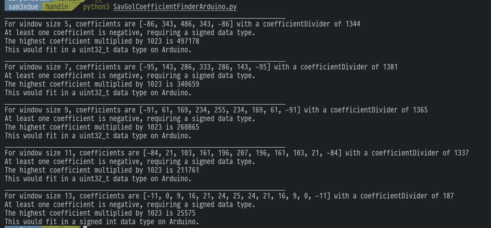{width=60%}

Met behulp van een Python-tool,`src/SavGolCoefficientFinderArduino.py,` heb ik de coëfficiënten vooraf berekend. Deze coëfficiënten worden dan geschaald naar gehele getallen om efficiënt te kunnen werken op de hardware. Dankzij deze aanpak maakt het mogelijk om snel en nauwkeurig te filteren, zelfs op minder krachtige microcontrollers.


NB 25/08 : Ik heb hier kort mee geëxperimenteerd tijdens mijn scriptie (precompilatie van Savitzky-Golay-coëfficiënten, uiteindelijk niet nodig door gebruik van een andere library, aleen stukje python-tool code), maar dat was meer in theorie. Ik heb dit  pas in de afgelopen maand geïmplementeerd; achteraf misschien een paar uur te veel tijd ingestopt omdat ik dacht dat PID-tuningproblemen lagen aan slechte filtering, en ik de Sav-gol filter meestal gewoon met polynomial 0 (moving average) gebruikte.


### Savitzky-Golay Filter Function

```{r figure_savgolay, echo = FALSE, fig.align='center', fig.cap = "Diagram of the SavGolayFilter Function" }
grViz("
digraph {
    newrank=true;
    node [shape=box]
    edge [arrowhead=open]

    // Entry point
    EntryPoint [label='savGolayFilter(uint16_t new_data)']

    // Variables
    SGdata [shape=ellipse, label='SGdata']
    SGdataIndex [shape=ellipse, label='SGdataIndex']
    ReturnValue [shape=ellipse, label='returnValue']
    Coefficients [shape=ellipse, label='coefficients']
    CoefficientDivider [shape=ellipse, label='coefficientDivider']

    // Conditional Blocks
    Order0 [label='SAV_GOL_POLYNOMINAL == 0']
    Order1 [label='SAV_GOL_POLYNOMINAL == 1']
    Order2 [label='SAV_GOL_POLYNOMINAL == 2']

    // Update Variables
    UpdateSGdata [label='Update SGdata and SGdataIndex']
    CalculateReturnValue [label='Calculate returnValue']

    // Error Handling
    ErrorHandling [label='Handle Errors in returnValue']

    // Relationships
    EntryPoint -> UpdateSGdata
    UpdateSGdata -> Order0
    UpdateSGdata -> Order1
    UpdateSGdata -> Order2

    Order0 -> CalculateReturnValue
    Order1 -> CalculateReturnValue
    Order2 -> CalculateReturnValue

    CalculateReturnValue -> ReturnValue

    ReturnValue -> ErrorHandling

    UpdateSGdata -> SGdata
    UpdateSGdata -> SGdataIndex

    CalculateReturnValue -> Coefficients
    CalculateReturnValue -> CoefficientDivider
    CalculateReturnValue -> ReturnValue
    CalculateReturnValue -> SGdata
    CalculateReturnValue -> SGdataIndex

    ErrorHandling -> ReturnValue
}
")
```

\newpage

# Appendix

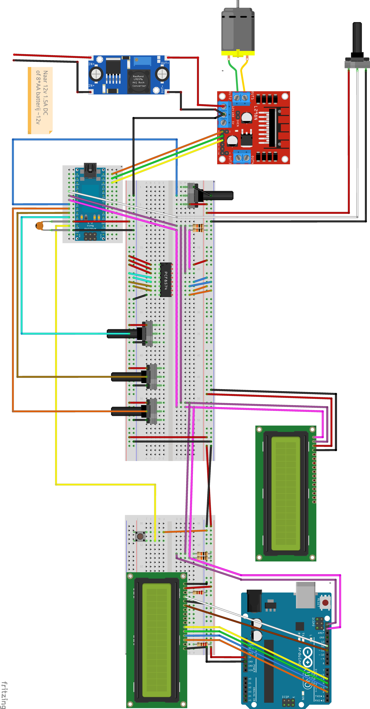


\includepdf[pages={-}]{TPD_files/figure-latex/figure_z45-1.pdf}
\includepdf[pages={-}]{TPD_files/figure-latex/figure_main-1.pdf} 
\includepdf[pages={-}]{TPD_files/figure-latex/figure_APmain-1.pdf} 
\includepdf[pages={-}]{TPD_files/figure-latex/figure_potmanager-1.pdf} 
\includepdf[pages={-}]{TPD_files/figure-latex/figure_ontwerp-1.pdf}


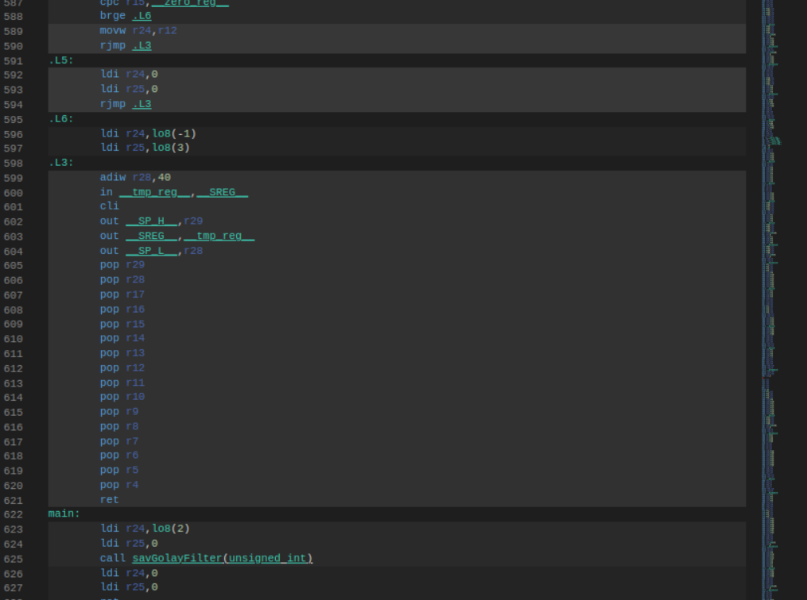

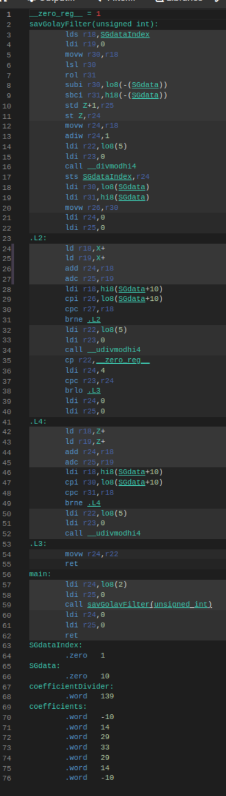

\clearpage

## Natuurkundige statica berekeningen voor benodigde kracht motor om staaf te bewegen.


Met dank aan Wolfram Alpha, ChatGPT en goedkeuring van mijn 3 huisgenoten die werktuigbouwkunde/Natuurkunden studeren. 

### Step 1: Calculate the Moment of Inertia for the Aluminum Bar
We first calculate the moment of inertia for the aluminum L profile bar of length 1 m and mass 0.115 kg. It is pivoted 70 cm from one end and 30 cm from the other end.

\begin{align*}
I_{\text{{bar}}} = \frac{1}{12} \times 0.115 \, \text{{kg}} \times (1 \, \text{{m}})^2 + 0.115 \, \text{{kg}} \times (0.2 \, \text{{m}})^2 
           = 0.009583 \, \text{{kg}}\cdot\text{{m}}^2 + 0.0046 \, \text{{kg}}\cdot\text{{m}}^2 
           = 0.014183 \, \text{{kg}}\cdot\text{{m}}^2
\end{align*}

### Step 2: Calculate the Moment of Inertia for Motor and Counterweight
For the motor side:

\begin{align*}
I_{\text{{counter}}} = 0.0404 \, \text{{kg}} \times (0.3 \, \text{{m}})^2 
                     = 0.0036 \, \text{{kg}}\cdot\text{{m}}^2
\end{align*}

For the counterweight:

\begin{align*}
I_{\text{{counter}}} = 0.0404 \, \text{{kg}} \times (0.3 \, \text{{m}})^2 
                     = 0.0036 \, \text{{kg}}\cdot\text{{m}}^2
\end{align*}

### Step 3: Calculate Total Moment of Inertia

Summing the moments of inertia for the bar, motor, and counterweight:

\begin{align*}
I_{\text{{total}}} = I_{\text{{bar}}} + I_{\text{{motor}}} + I_{\text{{counter}}} 
                   = 0.014183 \, \text{{kg}}\cdot\text{{m}}^2 + 0.0110 \, \text{{kg}}\cdot\text{{m}}^2 + 0.0036 \, \text{{kg}}\cdot\text{{m}}^2 
                   = 0.028783 \, \text{{kg}}\cdot\text{{m}}^2
\end{align*}

### Step 4: Calculate the Torque Required

To move 25 degrees (0.4363 rad) in 1 second, we calculate angular acceleration (α):

\begin{align*}
\alpha = \frac{\theta}{\Delta t} = \frac{0.4363 \, \text{{rad}}}{1 \, \text{{s}}} = 0.4363 \, \text{{rad/s}}^2
\end{align*}

Using the formula for torque (τ):
\begin{align*}
\tau = I_{\text{{total}}} \times \alpha = 0.028783 \, \text{{kg}}\cdot\text{{m}}^2 \times 0.4363 \, \text{{rad/s}}^2 
     = 0.0126 \, \text{{N}}\cdot\text{{m}}
\end{align*}

This is the torque needed to pivot the bar ±25 degrees within 1 second.

### Step 5: Calculate Thrust Required

To convert this torque to thrust, use:

\begin{align*}
\text{{Thrust}} = \frac{\tau}{r} = \frac{0.0126 \, \text{{N}}\cdot\text{{m}}}{0.7 \, \text{{m}}} 
                = 0.018 \, \text{{N}}
\end{align*}

To convert this to grams of thrust:


\begin{align*}
\text{{Thrust (g)}} = 0.018 \, \text{{N}} \times \frac{100 \, \text{{g}}}{9.81 \, \text{{m/s}}^2} \approx 1.8 \, \text{{g}}
\end{align*}

 
Achteraf komt dit vrijaardig overeen met de gemeten thrust van 2.3 gram (door de motor + propellor vast te maken op een weeg schaal, en het verschill tussen motor aan en uit te wegen.)


