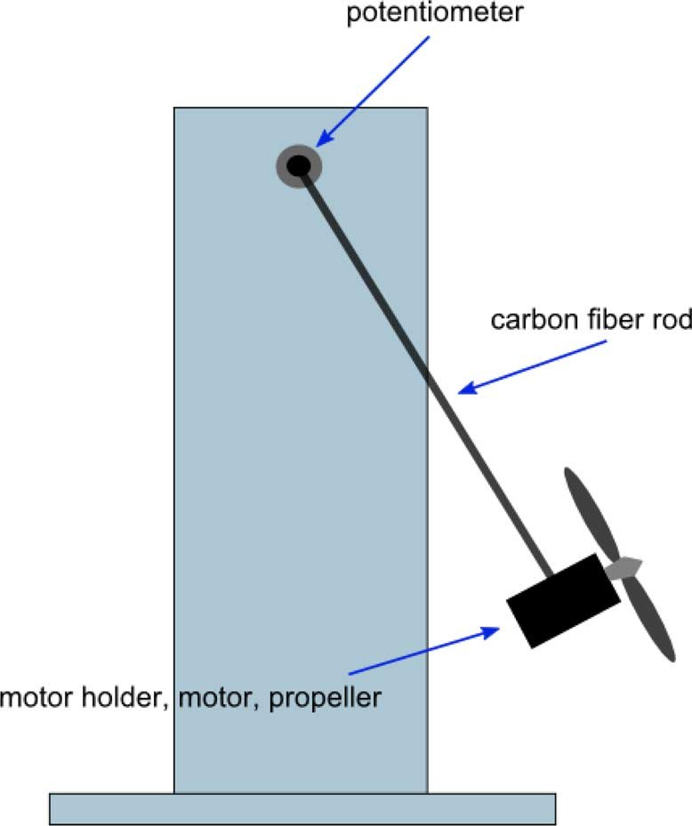

```{r setup, include=FALSE}
knitr::opts_chunk$set(echo = FALSE)
```

# Pendelum:

LEFT MOTOR side = 23.4g @ 50 cm

```{r echo=FALSE, out.width='60%'}

```


Of course! Here's a list of reminders about soldering electronics to refresh your memory:

Safety First:

Always wear safety glasses to protect your eyes from any flying solder or rosin.
Ensure adequate ventilation as the fumes from melted solder can be harmful.
Be cautious of the hot end of the soldering iron. It's very easy to accidentally burn yourself or melt nearby components or wires.
Keep a clean, clutter-free workspace.
Equipment Preparation:

Clean the soldering iron tip before and after every use. A clean tip ensures better heat transfer.
Tin the tip of the soldering iron with a thin layer of solder. This helps improve heat conductivity between the tip and the joint.
Temperature Settings:

For most electronics soldering, set the soldering iron temperature between 315°C to 370°C (600°F to 700°F).
Always allow the soldering iron to fully heat up before using.
Choose the Right Solder:

For electronics, it's common to use rosin core solder. The rosin acts as a flux to clean the metal surfaces during the soldering process.
Avoid using acid-core solder as it can damage electronic components.
If possible, use lead-free solder for environmental reasons and safety. However, remember that lead-free solder may require slightly higher temperatures.
Technique:

Heat the component and the pad (or the two components to be joined) simultaneously with the soldering iron, then touch the solder to the joint, not directly to the iron.
Use just enough solder to form a shiny, concave joint. Too much solder can cause bridges between circuits, while too little might not make a good connection.
Once the solder flows, remove the solder, then the iron, and allow the joint to cool without moving the component for a few seconds.
Avoid Cold Joints:

Cold joints happen when solder doesn't melt completely or if components move before the solder solidifies. They appear dull and grainy. They won't provide good electrical connectivity and are structurally weak. If you see one, reheat and reflow the joint.
Desoldering:

If you make an error, use desoldering wick or a desoldering pump to remove excess solder.
When using desoldering wick, place it on the joint and then press the hot soldering iron against it. The solder will be "wicked" up into the braid.
For the desoldering pump, heat the joint, then quickly place the pump's nozzle against the molten solder and press the button to suck the solder up.
Component Care:

Be cautious with heat-sensitive components. Using heat sinks (like alligator clips) can prevent damage by dissipating excessive heat.
Avoid bending component leads too much, as this can cause them to break.
Cleanup and Maintenance:

Once you're done, clean your soldering iron tip and apply a thin layer of solder to it to prevent oxidation.
Store the soldering iron in a safe place, away from flammable materials.
Regularly clean the soldering iron stand, especially the sponge. Use distilled water to wet the sponge.
Stay Calm and Patient:

If you're struggling with a joint, it's okay to take a break. Too much continuous heat can damage components.
Remember, like all skills, the more you practice soldering, the better you'll get at it. Happy soldering!
